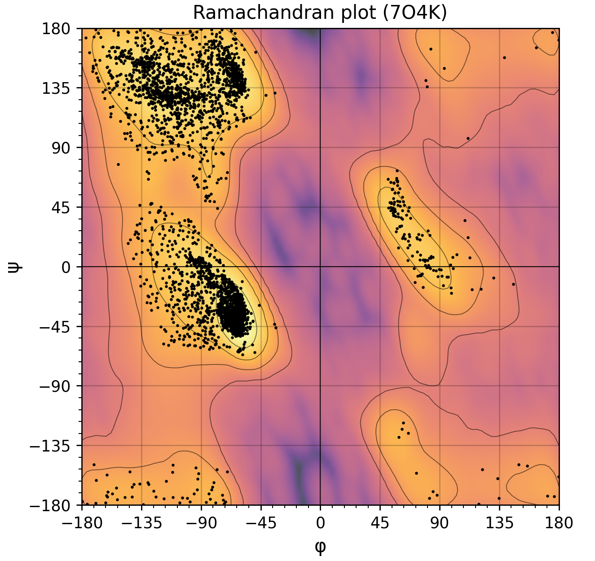

# Pymol-Ramachandran

A simple script to generate a Ramachandran plot from structures within pymol.



Over is an example of the generated ramachandran plot using the Yeast TFIIH structure from PDB.

## Installation / How-to-use

1. Download the repository to your computer. Store the code in $pwd (preferred). Find this directory by running,

```
PyMOL> pwd
```

The repository can be downloaded either using `Git` or `Download ZIP` directly in Github. Using git this can be done using

```
$ git clone https://github.com/exTerEX/pymol-ramachandran.git /path/to/pwd
```

2. Run script in pymol (example assume script is in $pwd)

```
$ run ramachandran.py
```

3. Generatet a Ramachandran plot. Fetch one or more structures in pymol and run

```
$ ramaplot()
```

or specify which model/residues to be used to generate the plot

```
$ ramaplot(model="(pdb-id)", resn="(residue)")
```

or use multiple models/residues

```
$ ramaplot(model=["(pdb-id)", "(pdb-id)", ...], resn=["(residue)", "(residue)", ...])
```

## License

This project is licensed under `ECL-2.0`. See [LICENSE](LICENSE) for more information.
